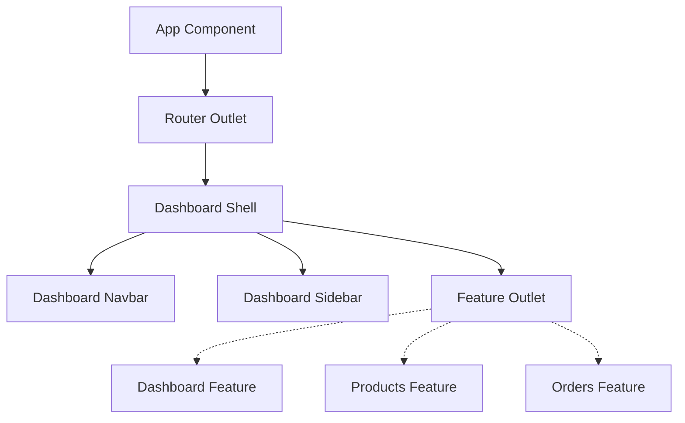

# Architecture Overview

This document describes the architectural patterns, project structure, and technical conventions of the **Invoria Web** application.

## 1. Architecture Style
Invoria Web follows a **Feature-Based Angular Architecture** using **Standalone Components**. The application is designed for high cohesion within features and low coupling between them.

### Key Principles
- **Self-Contained Features**: Each feature folder contains its own components, services, and models.
- **Standalone by Default**: All components are standalone, eliminating the need for `NgModules`.
- **Reactive State**: State is managed via RxJS observables and processed using `firstValueFrom` where async/await is preferred for readability in components.
- **Unified Design System**: A single source of truth for design tokens (CSS variables) is shared between Tailwind CSS 4 and PrimeNG.

---

## 2. Project Structure

```text
src/app/
├── core/               # (Planned) Singleton services, interceptors, global config
├── features/           # Domain-specific feature modules
│   ├── products/
│   │   ├── models/     # Interface and type definitions
│   │   ├── pages/      # Smart components (containers)
│   │   └── services/   # Data access services
│   └── ...             # Other features (orders, inventory, etc.)
├── layout/             # Shell components and navigation
├── shared/             # Reusable UI components, base entities, shared request shapes
│   ├── entities/       # Base classes for domain models
│   └── requests/       # Shared HTTP query/body fragments (e.g. paging)
├── styles/             # Design system configuration
│   ├── primeng/        # PrimeNG theme presets
│   └── tokens.css      # Core design tokens
└── app.routes.ts       # Centralized lazy-loaded routing
```

---

## 3. Feature Modules

Each feature (e.g., `products`, `orders`) is organized into:
- **`pages/`**: Contains "Smart Components" that coordinate between services and UI.
- **`services/`**: Feature-specific data access logic (Mock APIs or Backend APIs).
- **`models/`**: TypeScript interfaces defining the feature's data structures. Use dedicated files per contract (`*.entity.ts`, `*.request.ts`); do not add a feature-level barrel in `models/` (e.g. `product.ts`) that only re-exports types—import those files directly (see [api-services-and-models.md](./api-services-and-models.md)).

All feature routes are **lazy-loaded** in `app.routes.ts` to optimize initial bundle size.

---

## 4. Component Design

We follow a **Smart (Container) vs. Presentational (Dumb)** component pattern.

- **Smart Components** (`*.component.ts` in `pages/`):
    - Inject services.
    - Handle data fetching and state management.
    - Manage modal visibility and API interaction.
    - Example: `ProductsPageComponent` handles list loading, creation, and deletion.
- **Presentational Components**:
    - Focus on UI/UX.
    - Communicate via `@Input()` and `@Output()`.
    - (Planned) Extracted from `pages/` as features grow.

For a **concrete reference** of this split with modern signals—**`rxResource`**, **`linkedSignal`**, query-param pagination, and scoped **`MessageService`**—see [Component design rules](./component-design-rules.md) (Customers reference).

---

## 5. State Management

- **Local State**: Component-level state is managed via class properties and RxJS.
- **Global State**: (Planned) Core services or Signal-based stores for cross-feature data.
- **Patterns**: Use of `firstValueFrom` to handle RxJS streams in an `async/await` fashion for complex UI flows (e.g., multiple sequential API calls).
- **List pages** may instead use **Angular signals**, **`toSignal`/`computed`** for URL-derived params, and **`rxResource`** (with optional **`linkedSignal`** for view state that tracks server data). The Customers feature documents this pattern end-to-end in [Component design rules](./component-design-rules.md).

---

## 6. Routing Architecture

- **Root Redirect**: `/` redirects to `/dashboard`.
- **Layout Shell**: `DashboardShellComponent` provides the main layout (Navbar + Sidebar) for all feature pages.
- **Lazy Loading**: Every feature is loaded on demand using `loadComponent`.



---

## 7. Dependency Rules

1. **Isolation**: Features must not import from other features.
2. **Exception**: The `products` feature may import `features/inventory` for product batch UI (`ProductBatchesModalComponent` and related batch models/services). The `inventory` feature must not import from `products`; use `BatchesProductRef` (or similar) instead of `Product` entity types to keep the dependency one-way.
3. **Shared Usage**: Features may import from `shared/` and `core/`.
4. **Circular Dependencies**: Strictly forbidden; use `shared/entities` for common base classes.

---

## 8. UI & Design System

### Tailwind Design System (v4)
The application uses **Tailwind CSS 4** with a CSS-first configuration.
- **Semantic Tokens**: Defined in `src/styles/tokens.css` (e.g., `--c-primary`, `--c-surface`).
- **Mapping**: The `@theme` block in `src/styles.css` maps CSS variables to Tailwind utilities (`bg-primary`, `text-error`).
- **Consistency**: Hardcoded colors (e.g., `bg-blue-500`) are discouraged in favor of semantic tokens (`bg-primary`).

### PrimeNG Integration
- **Preset**: A custom `AuraInvoria` preset (`src/styles/primeng/aura.preset.ts`) maps PrimeNG's `--p-*` variables to the application's semantic tokens.
- **Theming**: PrimeNG components automatically adapt to Light/Dark mode via the `.dark` class on the document root.

---

## 9. API Communication

- **Services**: All API calls must go through a Service class.
- **HttpClient**: Services use Angular's `HttpClient` (mocked in `products-mock-api.service.ts` for now).
- **Abstraction**: Components should not know about the underlying API implementation (e.g., whether it's REST or GraphQL).

For **file naming**, **entity vs. request types**, and **typed API service patterns** (including `ApiResponse`, `Paging`, and `Entity`), see [api-services-and-models.md](./api-services-and-models.md).

---

## 10. Cross-Cutting Concerns

- **Error Handling**: Handled at the service level or via global error listeners (configured in `app.config.ts`).
- **Loading States**: Managed per-component (e.g., `isListLoading`) with skeleton screens (`p-skeleton`) during data fetching.
- **Notifications**: PrimeNG `Toast` and `MessageService` are used for user feedback.

---

## 11. Recommendations

- **Standardize Presentational Components**: As features grow, move repetitive UI patterns from `pages/` into shared or feature-specific dumb components.
- **Form Abstraction**: Use Reactive Forms for complex validation instead of Template-driven flows where possible.
- **Core Module**: Formally establish a `core/` directory for system-wide logic like Auth Interceptors and Config Services.
